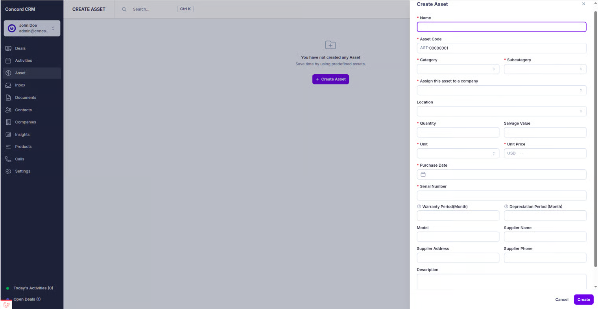

# 📦 Creating an Asset

To create an asset in Perfex CRM using the Asset Management module, follow these steps:

<figure><figcaption></figcaption></figure>

### 1. **Access the Assets Section**

Navigate to the **Assets** section from the main dashboard or the sidebar menu. This is where you can manage and create all assets for your organization.

### 2. **Create a New Asset**

Click on the **New Asset** button. This will open a form where you can enter the details required for the asset registration.

### 3. **Fill in Required Asset Details**

In the asset creation form, provide the necessary details, including:

#### **Basic Information (Required)**

* **Asset Name**: Enter a descriptive name for the asset (e.g., "MacBook Pro 16-inch", "Office Desk")
* **Asset Code**: The system auto-generates a unique code (AST-00000001), but you can modify it if needed
* **Category**: Select the main category from the dropdown (e.g., IT Equipment, Furniture, Vehicles)
* **Subcategory**: Choose the specific subcategory that best describes your asset
* **Assign Asset To**: Select the company/department that will be responsible for this asset
* **Quantity**: Enter the number of items being added
* **Unit**: Select the unit of measurement (pieces, sets, meters, etc.)
* **Unit Price**: Enter the purchase price per unit
* **Purchase Date**: Set the date when the asset was purchased

#### **Optional Details**

* **Location**: Choose where the asset will be stored or used
* **Serial Number**: Enter the manufacturer's serial number (auto-generated if left blank)
* **Model**: Specify the asset model or version
* **Description**: Add any additional details about the asset
* **Warranty Period**: Enter warranty duration in months
* **Depreciation Period**: Set depreciation period in years for accounting purposes
* **Salvage Value**: Enter the expected value at end of asset life

#### **Supplier Information (Optional)**

* **Supplier Name**: Name of the vendor or supplier
* **Supplier Address**: Supplier's business address
* **Supplier Phone**: Contact number for the supplier

#### **Asset Image (Optional)**

* **Upload Image**: Attach a photo of the asset for easy identification

### 4. **Review and Validate**

Once all details are entered, review the asset information for accuracy. Ensure that:

* Asset name is descriptive and clear
* Category and subcategory are correctly selected
* Quantity and pricing information is accurate
* Required fields are properly filled

### 5. **Save and Register**

Click **Save** to create the asset. The system will automatically:

* Generate a unique QR code for the asset
* Create an asset code if you haven't customized it
* Generate a serial number if not provided
* Set the available quantity equal to the total quantity
* Send a notification to the assigned company
* Record the asset creation in the system timeline

<figure><figcaption>
Asset Detail
</figcaption></figure>

### 6. **What Happens Next**

After successful creation:

* The asset appears in your **Assets** list with status "Available"
* A **QR code** is generated for physical asset tagging
* The assigned company receives an **email notification**
* The asset is ready for allocation to individual users
* **Financial tracking** begins if depreciation period is set

### 💡 **Pro Tips**

* **Use consistent naming**: Follow a standard naming convention for similar assets
* **Upload images**: Photos help with asset identification and audits
* **Set warranty periods**: This helps track when assets need replacement
* **Configure depreciation**: Important for accounting and financial reporting
* **Print QR codes**: Attach them to physical assets for easy scanning and management
